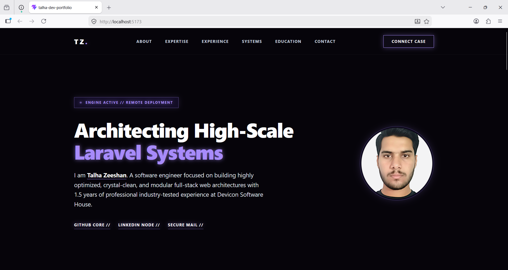
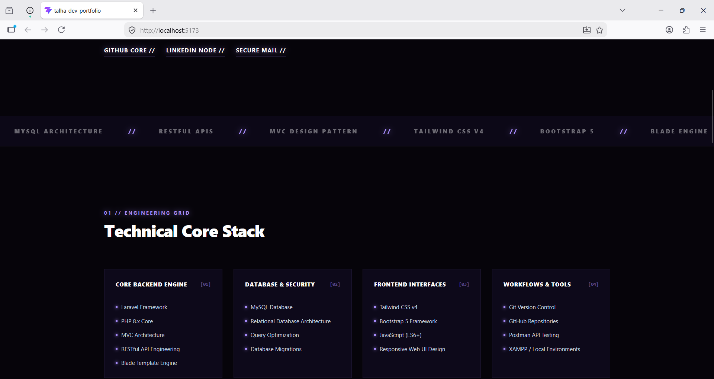
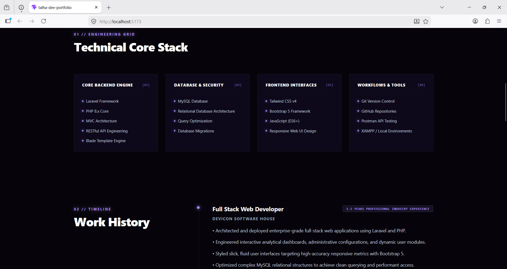
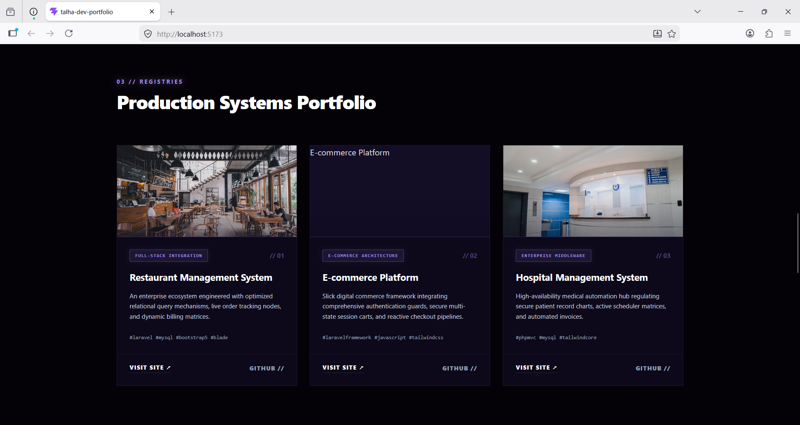
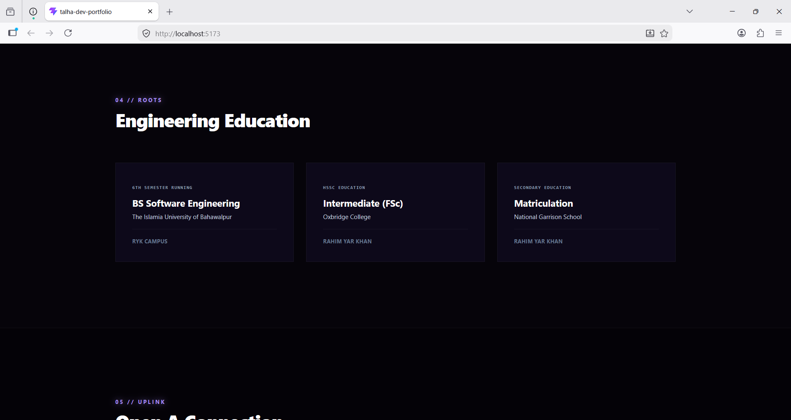
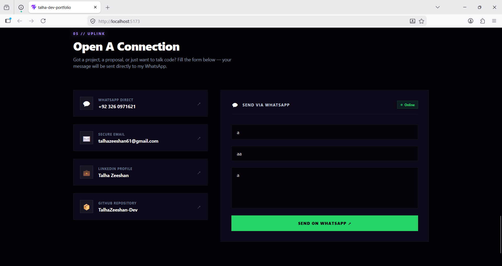

# ✨ Talha Dev Portfolio

Modern, responsive and visually attractive developer portfolio built using React.js and modern frontend technologies.

---

# 🌐 Live Portfolio

Add your deployed Vercel link here:

[🚀 View Portfolio](PASTE_YOUR_VERCEL_LINK)

---

# 👨‍💻 About Me

Hi, I'm **Talha Zeeshan** — a passionate **Full Stack & Frontend Developer** focused on building responsive, modern and user-friendly web experiences.

I enjoy creating clean UI designs, interactive experiences and scalable web applications using modern technologies.

---

# 🛠 Tech Stack

### Frontend

* React.js
* JavaScript
* HTML5
* CSS3
* Bootstrap 5
* Tailwind CSS

### Backend

* Laravel
* PHP
* MySQL

### Tools

* Git
* GitHub
* VS Code
* Vite

---

# ✨ Features

✔ Modern UI Design
✔ Responsive Layout
✔ Smooth Animations
✔ Attractive Color Combination
✔ Fast Performance
✔ Mobile Friendly

---

# 🖼 Portfolio Screenshots

## Home Page



---

## About Section



---

## Skills Section



---

## Projects Section



---

## Services Section



---

## Contact Section



---

# ⚙ Installation

Clone repository:

```bash
git clone https://github.com/TalhaZeeshan-FullStackDeveloper/react-portfolio.git
```

Install dependencies:

```bash
npm install
```

Run project:

```bash
npm run dev
```

Build:

```bash
npm run build
```

---

# 🔗 Connect With Me

### LinkedIn

https://www.linkedin.com/in/talha-zeeshan-developer-0b7293389

### GitHub

https://github.com/TalhaZeeshan-FullStackDeveloper

---

# ⭐ Support

If you like this project, give it a ⭐ on GitHub.
